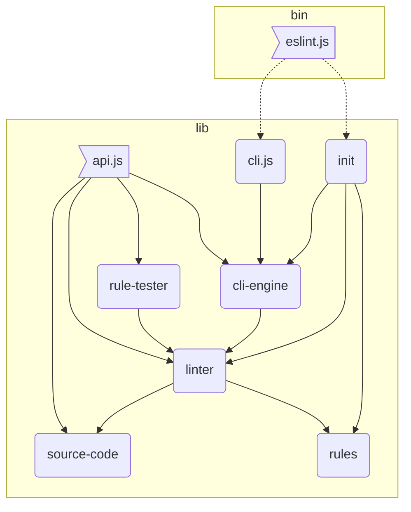
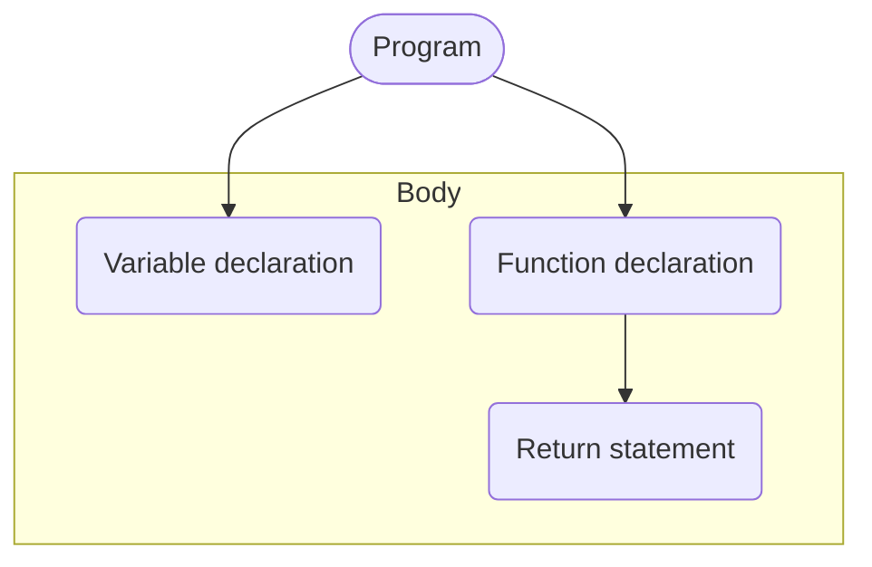
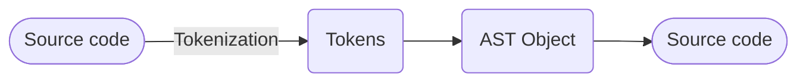

# 📝 ESLint deep dive

The purpose of this repository is to help you understand how ESLint works, how can you create rules, parser and configs based on TypeScript language.

Before anything to do, run `npm install`.

More about [ESLint](https://eslint.org/)

ESLint is a tool for identifying and reporting on patterns found in ECMAScript/JavaScript code, with the goal of making
code more consistent and avoiding bugs.

## Overview

- 🧰 [Parts of ESLint](#-parts-of-eslint)
    - 💻 [CLI](#-cli)
    - ⚙️ [CLI Engine](#-cli-engine)
    - 🎉 [Linter](#-linter)
- 🔬 [How dose ESLint work in short](#-how-does-eslint-work-in-short)
    - [AST](#ast)
    - [Tokenization](#tokenization)
      - [What tokens are?](#what-are-tokens)
    - [ESPree](#espree)
- 🧾 [Rules](#-rules)
  - ✍️ [Write custom rule](#-write-custom-rule)
  - 🥇 [Custom rule testing](#-custom-rule-testing)
- 📌 Parsers (In progress)

## 🧰 Parts of ESLint

- <b>[CLI](#-cli)</b> - This is the heart of the ESLint. It takes an array of arguments and then uses eslint to
  execute the commands.
- <b>[CLI Engine](#-cli-engine)</b> - This module is `CLIEngine` class that finds source code files and configuration
  files then does code verifying with the `Linter` class. This includes the loading logic of configuration files,
  parsers, plugins, and formatters.
- <b>[Linter](#-linter)</b> - This module is the core `Linter` class that does code verifying based on configuration
  options.
- <b>[Rules](#-rules)</b> - This contains built-in rules.
- <b>Rule tester</b> - This module is `RuleTester` class that is a wrapper around Mocha so that rules
  can be unit tested.
- <b>Source Code</b> - This module is `SourceCode` class that is used to represent the parsed source code.

### 💻 CLI

The `cli` object is the API for the command line interface. Literally, the `bin/eslint.js` file simply passes arguments
to the `cli` object and then sets `process.exitCode` to the returned exit code.

The main method is `cli.execute()`, which accepts an array of strings that represent the command line options (as
if `process.argv` were passed without the first two arguments). If you want to run ESLint from inside of another program
and have it act like the CLI, then `cli` is the object to use.

This object’s responsibilities include:

- Interpreting command line arguments
- Reading from the file system
- Outputting to the console
- Outputting to the filesystem
- Use a formatter
- Returning the correct exit code

### ⚙️ CLI Engine

The `CLIEngine` type represents the core functionality of the CLI except that it reads nothing from the command line and
doesn’t output anything by default. Instead, it accepts many (but not all) of the arguments that are passed into the
CLI. It reads both configuration and source files as well as managing the environment that is passed into the `Linter`
object.

The main method of the `CLIEngine` is `executeOnFiles()`, which accepts an array of file and directory names to run the
linter on.

This object’s responsibilities include:

- Managing the execution environment for `Linter`
- Reading from the file system
- Reading configuration information from config files (including `.eslintrc` and `package.json`)

### 🎉 Linter

The main method of the `Linter` object is `verify()` and accepts two arguments: the source text to verify and a
configuration object (the baked configuration of the given configuration file plus command line options). The method
first parses the given text with `espree` (or whatever the configured parser is) and retrieves the AST. The AST is
produced with both line/column and range locations which are useful for reporting location of issues and retrieving the
source text related to an AST node, respectively.

Once the AST is available, `estraverse` is used to traverse the AST from top to bottom. At each node, the `Linter`
object emits an event that has the same name as the node type (i.e., “Identifier”, “WithStatement”, etc.). On the way
back up the subtree, an event is emitted with the AST type name and suffixed with “:exit”, such as “Identifier:exit” -
this allows rules to take action both on the way down and on the way up in the traversal. Each event is emitted with the
appropriate AST node available.

This object’s responsibilities include:

- Inspecting JavaScript code strings
- Creating an AST for the code
- Executing rules on the AST
- Reporting back the results of the execution

## 🔬 How does ESLint work in short?

### Tokenization
Tokenization is a step during source code parsing.

#### What are tokens?
Tokens represent those units from which the code is built, like Keyword (`const`), Identifier (`foo`, `bar`), Punctuator (`=`, `{`, `}`).
These tokens help us to get some information about source or make changes and help parser to produce the AST object.
 I have created a simple tokenizer which you can find [src/ast-demo/convert-source-code-to-tokens.util.ts](src/ast-demo/convert-source-code-to-tokens.util.ts) in this repository.
Run `npm run ast-demo:start` to see what happens.

### AST

Abstract Syntax Tree is a tree representation of the abstract syntactics structure of text written in a formal
language (in our case the JavaScript code). Here is an online [AST playground](https://astexplorer.net/).
 If you want to imagine how dose AST look like, here is a diagram about it.
 I have created simple tokens-to-AST and AST-to-source parsers which you can find [src/ast-demo/convert-tokens-to-ast.util.ts](src/ast-demo/convert-tokens-to-ast.util.ts) and [src/ast-demo/convert-ast-to-source-code.util.ts](src/ast-demo/convert-ast-to-source-code.util.ts) 
and also I have an exercise [src/ast-demo/index.ts](src/ast-demo/index.ts) for you in this repository. 
Run `npm run ast-demo:start` to see what happens.

### ESPree

[ESPree](https://github.com/eslint/espree) is a parser which creates 
- Tokens (one dimensional array containing tokens)
- AST object based on ESTree specification

from source code. 

In short the steps are the following

You can find [src/espree-demo/index.ts](src/espree-demo/index.ts) in this repository.
Run `npm run espree-demo:start` to see what happens.

Side note: ESPree uses [AcornJS](https://github.com/acornjs/acorn) to tokenize and parse source code. Actually the AcornJS is just wrapped (extended with some ESPree feature).

## 🧾 Rules

Rules are the core building block of ESLint. A rule validates if your code meets a certain expectation, and what to do
if it does not meet that expectation. Rules can also contain additional configuration options specific to that rule.

ESLint provides us with many built-in rules that you can use, on the other hand you have opportunity to write custom rules to which fit your idea.

### ✍️ Write custom rule
I have produced a demo example which you can find in the [src/js-rule-demo/prefer-strict-equal.rule.ts](src/js-rule-demo/prefer-strict-equal.rule.ts) and [src/js-rule-demo/index.ts](src/js-rule-demo/index.ts) files.
Run `npm run js-rule-demo:start` to see what happens.

### 🥇 Custom rule testing
I have created a demo example which you can find in the [src/js-rule-demo/prefer-strict-equal.rule.spec.ts](src/js-rule-demo/prefer-strict-equal.rule.spec.ts) file.
Run `npm run js-rule-demo:test-watch` to see what happens.
